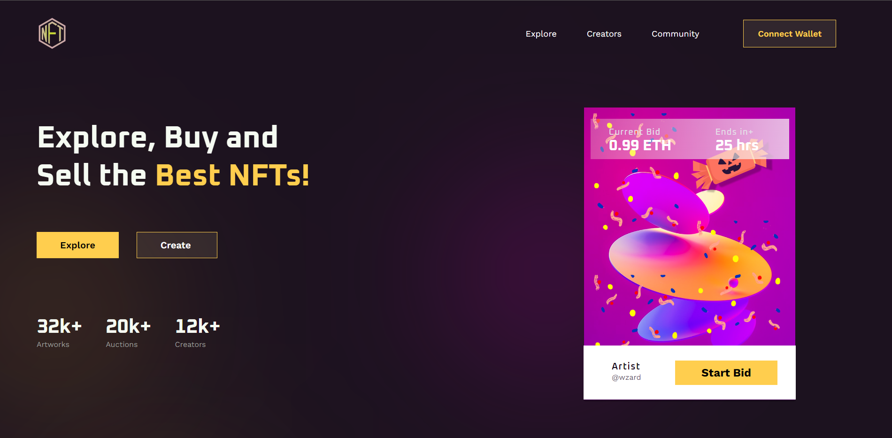
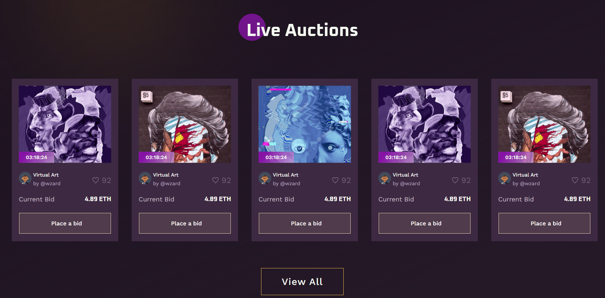
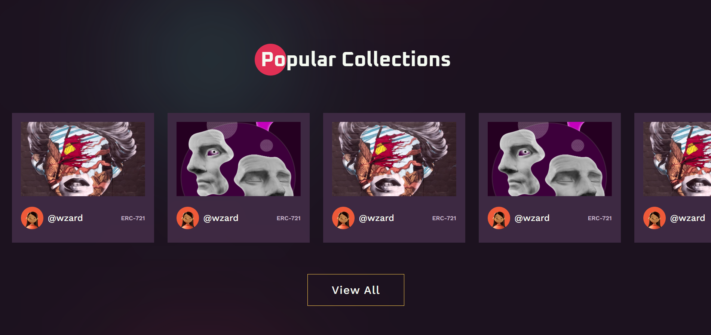
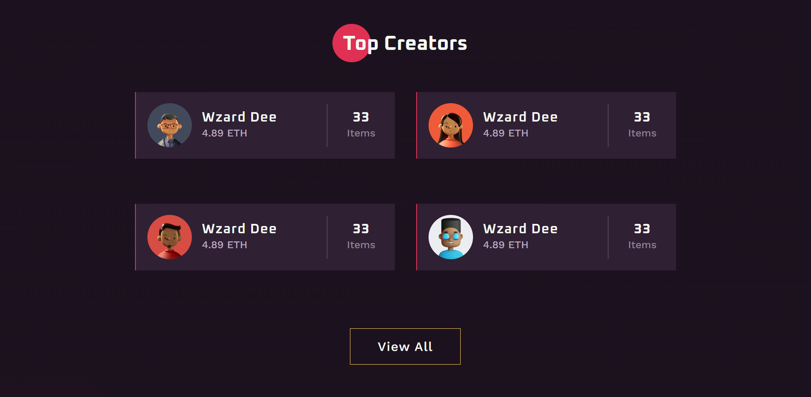
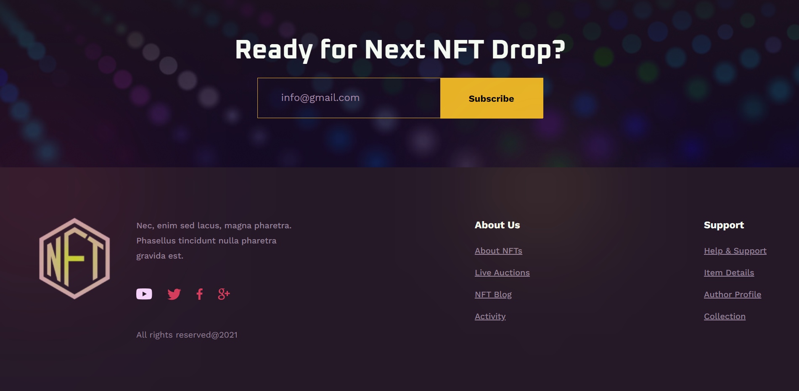

<h1 align="center">
    NFT Landing Page
</h1>


## 🤝Collab:
Atividade feita em conjunto com [Pablo Kauã](https://github.com/pablokaua), para o estartando devs.


## 💻 Estartando Devs:
O Estartando Devs é um projeto social e tem como objetivo transformar o mundo através da educação e tecnologia.<br>
[Estartando Devs](https://www.estartandodevs.com.br/)

## 📜 Sobre:
Recriar layout responsivo do [Figma](https://www.figma.com/file/iNran01uvqlygPb2KVhWkJ/Exclusive-Dark-Version-NFT-Marketplace-Website-UI-UX-Responsive-Design-(Community))

## 🚀 Tecnologias:
* HTML
* CSS
* Git e Github

## 🧾 Resultado:


##



##



##


##



##



---

## 👥 Clone o projeto:
```bash
    # Digite o seguinte comando no bash:
    $ git clone https://github.com/zonzobulo/landing-page-NFT.git
```
